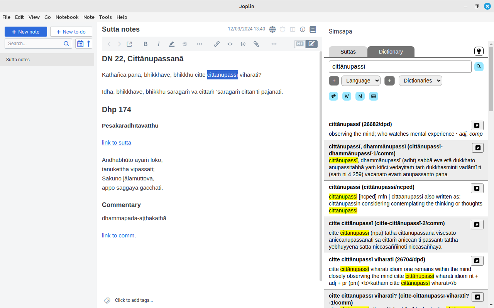
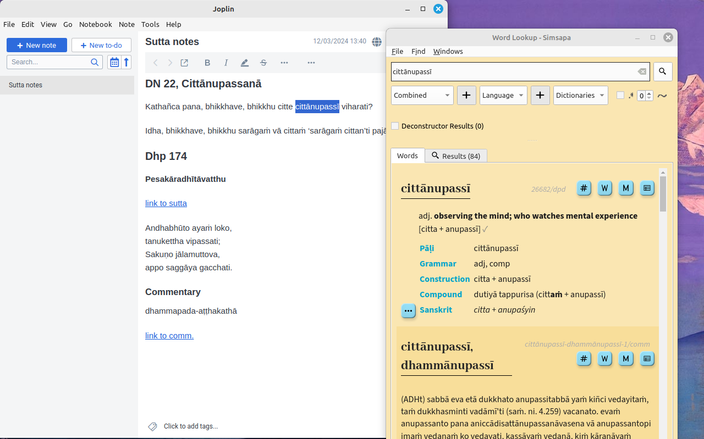

# Simsapa Joplin plugin

This is a sub-module repo for [simsapa-extensions-and-plugins](https://github.com/simsapa/simsapa-extensions-and-plugins)

The plugin requires [Simsapa Dhamma Reader](https://simsapa.github.io/) to be installed to work.

Start the Simsapa app, close the main window and let the app stay in the
background. The plugin makes HTTP requests to the application.

When clicking the plugin's icon (book 📓), the sidebar is opened.

The sidebar can be used to search Pāli dictionaries or suttas.

Keyboard shortcuts (`Ctrl` is `Cmd` on MacOS):

- `Ctrl + Shift + F10` Open Sidebar
- `Ctrl + Shift + D` Lookup Selection in Dictionary

Select a word or some text, and use `Ctrl + Shift + D` to trigger a dictionary lookup.

- If the sidebar is open, the results are shown there.
- If the sidebar is closed, it should open a _Simsapa Word Lookup_ window with the results (including Pāli accents).

If the _Word Lookup_ does not pop-up, the system may prevent it being opened. In this case:

Open _Word Lookup_ in Simsapa first, move it next to Obsidian, and use double-click on work in your note's text to trigger a lookup. The window should respond by showing the results.
